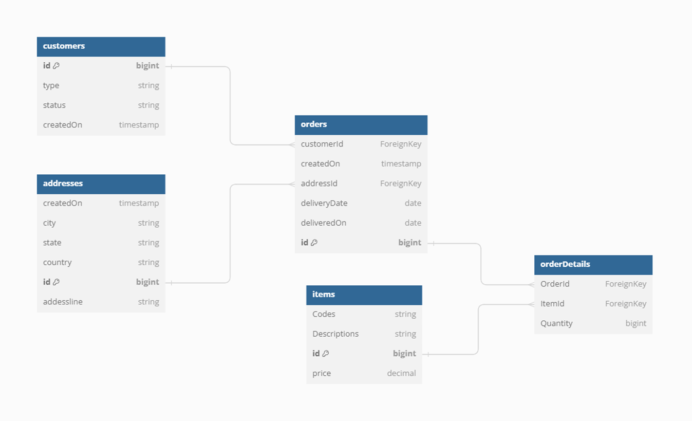
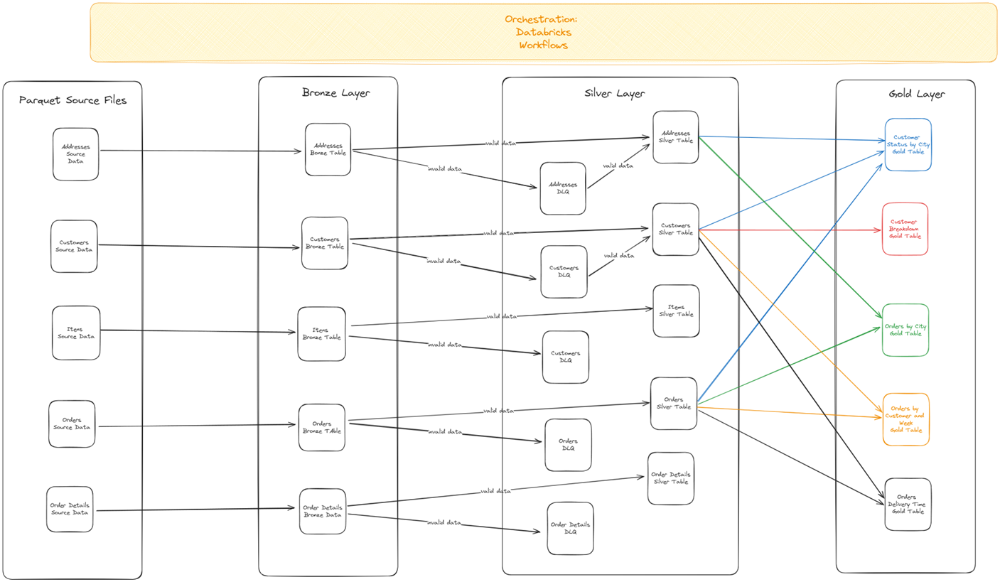
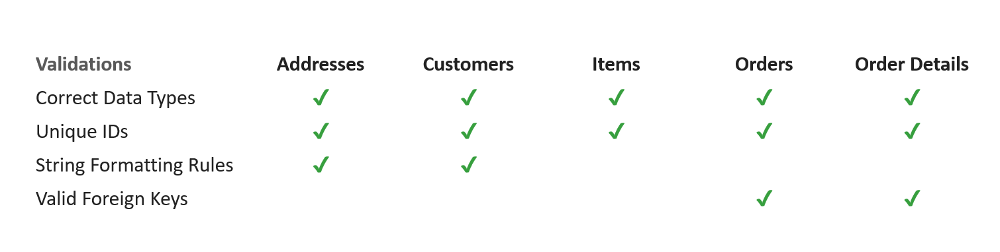
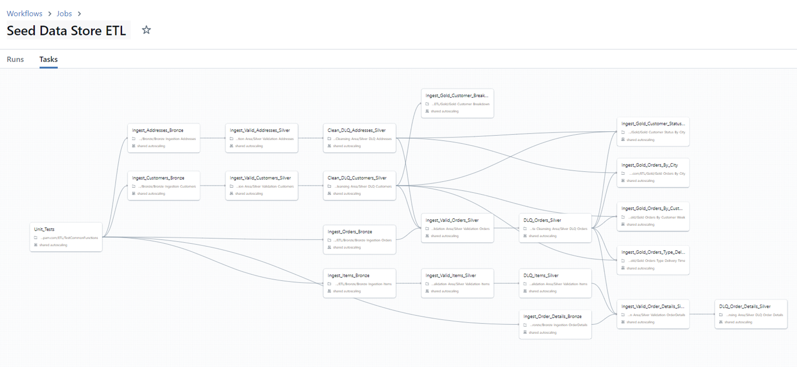
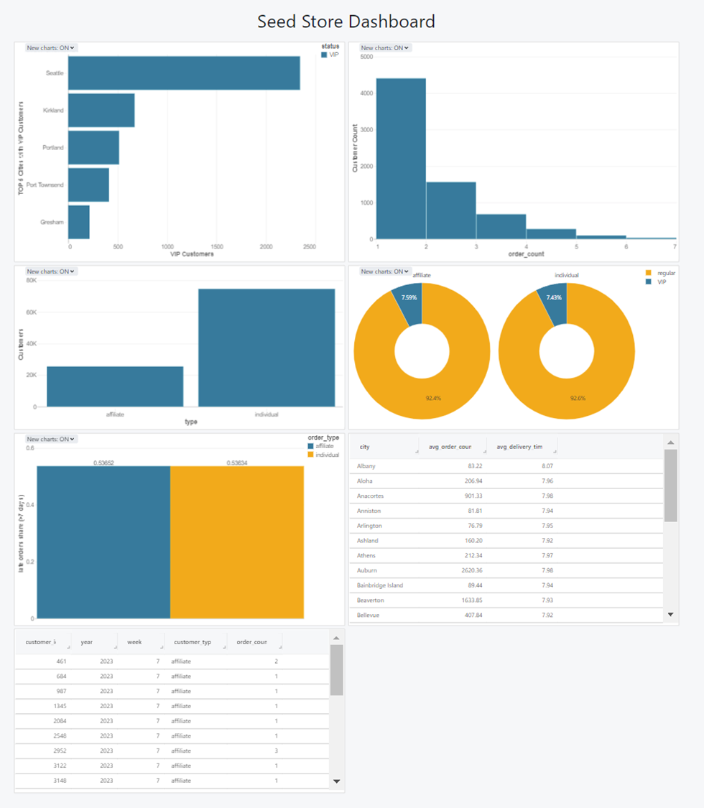

# 🏬 Retail Data Warehouse – Capstone Project  
**Author:** Joao Pereira  
**Conclusion Date:** March 14, 2024  
**Program:** Master's in Data Engineeing by EPAM – Capstone Project

## 📌 Project Overview  
This project focuses on designing and building a modern **data warehouse** for a retail business selling seeds, which is transitioning away from a legacy system with manually entered, unvalidated geodata. The primary goals are:

- Clean and validate historical data  
- Automate ingestion and transformation pipelines  
- Implement modern **medallion architecture** (Bronze → Silver → Gold)  
- Enable robust data governance and traceability via **Dead Letter Queue (DLQ)**  
- Provide business insights through analytics and dashboards  

## 🧱 Project Constraints  
This capstone project was developed as part of the Master's in Data Engineering by EPAM.  

A key requirement was that **all components had to be implemented exclusively within the Databricks ecosystem**, including:  
- Ingestion, validation, and transformation notebooks  
- Storage layers using Delta Lake  
- Workflow orchestration  
- Dashboard creation  

No external systems or services were used, ensuring full alignment with Databricks-native solutions.

## 🧩 Available Source Data  
- Items sold  
- Customer base  
- Customer addresses  
- Orders and order details  

## ❓ Business Questions Answered  
The project provides insight into customer segmentation and delivery performance through five key queries:

1. **Top 5 cities** with the highest number of VIP customers  
2. **Total customer count**, broken down by type and kind  
3. List of **affiliate customers with <5 orders per week**  
4. **Average delivery time** to specific cities and number of orders  
5. **Orders with delivery >7 days**, overall and by order type  

## 🏗️ Architecture & Workflow  

### 📐 ER Diagram & Dataflow  
A comprehensive data model was created to map out relationships and dependencies between tables. The dataflow diagram illustrates the transition of data through each architectural layer.

### 🔁 Layers  
- **Bronze Layer:** Raw ingestion from source systems  
- **Silver Layer:** Cleaned and validated data; invalid records go to DLQ  
- **Gold Layer:** Aggregated/enriched tables for business intelligence  

### ✅ Validation & DLQ Strategy  

The following automated data validations were implemented for each of the tables:

- Data is validated post-ingestion  
- Records failing validation are stored in **Dead Letter Queues**  
- DQL tables contain records that have been invalidated. It contains also information regarding what columns caused the record to be labeled as invalid, if the record has been meanwhile validated and a timestamp. 

### 📓 Notebooks Structure  
- Ingestion to Bronze tables  
- Validation & separation to Silver and DLQ  
- Cleansing & enrichment for Gold tables  
- Dashboard-ready consumption layer  

## 📂 Data Pipeline Structure

The data pipeline follows a structured, layered approach aligned with the Medallion Architecture, using Databricks notebooks at each stage:

1. **Bronze Layer – Raw Ingestion**  
   Source data is ingested into Bronze tables with minimal transformation. This stage ensures data is captured in its original form for traceability.

2. **Silver Layer – Validation & Dead Letter Queue (DLQ)**  
   Data is validated and cleaned. Valid records are written to Silver tables, while invalid records are sent to DLQ tables for further inspection.  
   ⚠️ *Validation of foreign key relationships is deferred until parent tables have completed validation.*

3. **DLQ Processing – Cleansing & Recovery**  
   Invalid records stored in DLQ tables are processed and, where possible, corrected. This allows for reintegration into the pipeline once issues are resolved.

4. **Gold Layer – Enrichment & Aggregation**  
   Enriched and grouped datasets are created to answer key business questions and power downstream analytics.  
   ⚠️ *Gold notebooks depend on all related Silver tables being fully validated and complete.*

## 📊 Dashboard  
A basic visual analytics layer was created to illustrate the type of insights that could be presented to stakeholders. These include customer distribution across cities, order performance metrics, and delivery time analysis.

## 🧠 Key Takeaways  
- Built a full **data warehouse solution using medallion architecture**  
- Gained practical experience in **data validation and DLQ usage**  
- Learned the importance of **clear modeling before implementation**  
- Refactoring with **parameterized notebooks** is a future improvement point  

## 🚀 Next Steps  
- Refactor notebooks to reduce code repetition  
- Leverage **Databricks Workflows** with parameters  
- Enhance **data governance** with metadata tracking  
- Implement alerting/monitoring for DLQ entries
